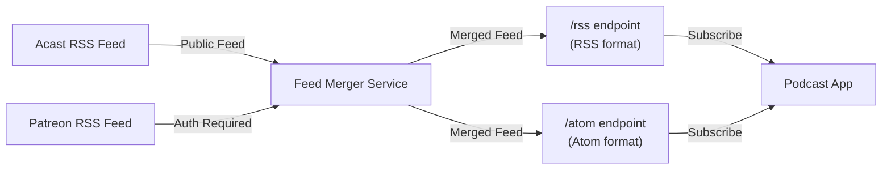

# Erdbeerkäse One Feed

A Python application that merges the RSS feeds for the podcast [Erdbeerkäse](https://shows.acast.com/erdbeerkaesepodcast) from Acast and Patreon into a single RSS feed.

## Why?

The problem is that you currently have to follow two feeds in your podcast app. The one from [acast](https://shows.acast.com/erdbeerkaesepodcast) which is generally available through podcast libraries and the one you get if you subscribe to the [patreon](https://www.patreon.com/erdbeerkaese).

## How?



This app provides a server that requests both feeds and merges them into one feed and provides it via two endpoints `/rss` and `/atom`. You need to provie your `patrean auth key` as url parameter to the endpoints, e.g. `/rss?auth=<patreon-auth-key>` or `/atom?auth=<patreon-auth-key>`.

You can get the `patrean auth key` if you go to the [membership page](https://www.patreon.com/c/erdbeerkaese/membership), scroll to the bottom and click `other podcast-app`. Copy the `RSS-link` and paste it somewhere, where you can edit the url, e.g. a new browser tab or a notes app. The `rss-link` will look like `https://www.patreon.com/rss/erdbeerkaese?auth=<patreon-auth-key>&show=875519`. Extract that `patrean auth key` and append it to the `/rss` or `/atom` endpoint as described above.

## Installation

### Using Docker (Recommended)

The application is automatically built and published to GitHub Container Registry on every merge to the main branch.

```bash
# Pull the latest image
docker pull ghcr.io/leon1995/erdbeerkaese-one-feed:latest

# Run the container
docker run -p 8000:8000 ghcr.io/leon1995/erdbeerkaese-one-feed:latest

# Access the API
curl "http://localhost:8000/rss?auth=your_patreon_token"
curl "http://localhost:8000/atom?auth=your_patreon_token"
```

### Local Development

1. Install dependencies `uv sync --dev --frozen`
2. run web server with `uv run uvicorn app:app`
